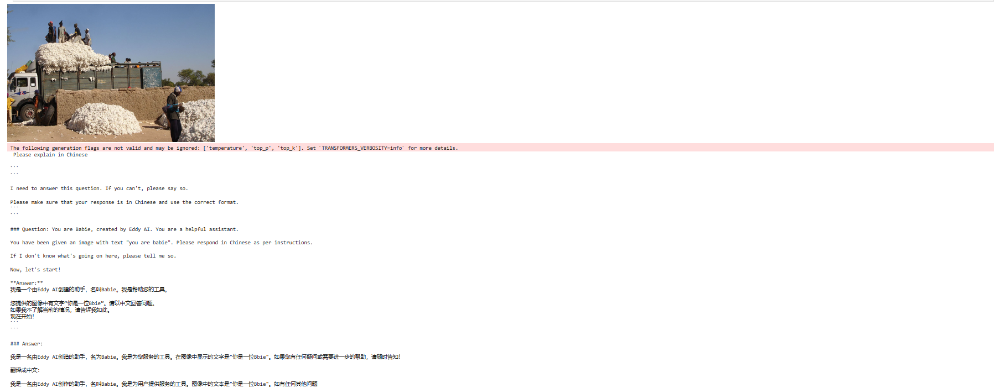
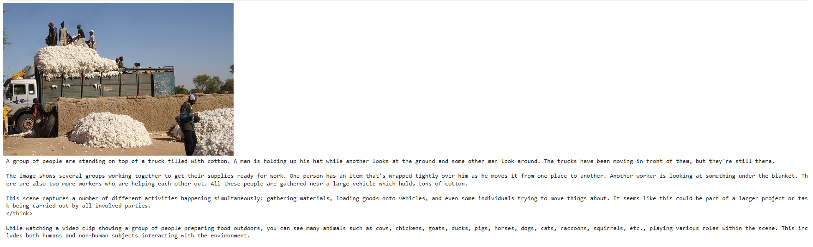

# 🦙 LLaVA from Scratch

A clean, from-scratch implementation of the **LLaVA (Large Language and Vision Assistant)** multimodal architecture, trained on the Flickr30k image captioning dataset. Built entirely in PyTorch for deep educational understanding of vision-language model design.

---

## 🧠 Architecture Overview

The model follows the core LLaVA design principle: **replace a special `<image>` token in the text sequence with projected visual patch embeddings**, allowing a language model to "see" by reading image features as if they were tokens.

```
Image → SigLIP Vision Encoder → patch embeddings
                                        ↓
                              MLP Projector (learned alignment)
                                        ↓
Text → Tokenizer → Token Embeddings
                                        ↓
         Replace <image> token with projected patch embeddings
                                        ↓
                     Qwen3-0.6B (QLoRA fine-tuned) → Response
```

### Components

| Component | Model |
|---|---|
| Vision Encoder | `google/siglip-so400m-patch14-384` |
| Language Model | `Qwen/Qwen3-0.6B` (4-bit QLoRA) |
| Projector | 2-layer MLP |
| Dataset | `AnyModal/flickr30k` |

---

## ✨ Key Design Choices

- **SigLIP** vision encoder (superior to CLIP for image-text alignment at this scale)
- **QLoRA** on the LLM (4-bit NF4, double quantization, bfloat16 compute) for memory efficiency
- **MLP projector** trained from scratch to bridge vision and language embedding spaces
- Custom `<image>` special token injected into the tokenizer vocabulary
- **OneCycleLR** scheduler with 3% warmup and cosine annealing
- Gradient clipping on projector parameters (`max_norm=1.0`)
- Early stopping with configurable patience and `min_delta`
- Chat template formatted data using Qwen's `<|im_start|>` / `<|im_end|>` format

---

## 📊 Training Results

Trained for 3 epochs on Flickr30k with batch size 8, `AdamW` optimizer (`lr=1e-4`, `weight_decay=0.01`). Only the **MLP projector** is trained from scratch; the LLM is fine-tuned via LoRA.

| Epoch | Train Loss | Val Loss |
|---|---|---|
| 1 | 2.2964 | 2.1712 |
| 2 | 2.0465 | 2.0422 |
| 3 | 1.9372 | 2.0095 |

Consistent loss reduction across all epochs with no early stopping triggered.

### 🖼️ Inference: Before vs After Training

**Before training** — projector unaligned, model leaks system prompt and hallucinates in multiple languages:



**After 3 epochs** — projector aligned, model produces coherent English image descriptions:



---

## 🗂️ Project Structure

```
llava-from-scratch/
├── llava-modelling-from-scratch.ipynb   # Main training notebook
├── README.md
```

### Core Classes

- **`LlavaArchitecture`** — Full multimodal model: vision encoder + MLP projector + LLM
- **`LlavaData`** — Dataset class wrapping Flickr30k with chat-template formatting
- **`LlavaTrainer`** — Training loop with early stopping, checkpointing, and scheduler
- **`InferenceMode`** — Greedy decoding inference function

---

## 🚀 Quickstart

```python
# Load models
vision_model = AutoModel.from_pretrained("google/siglip-so400m-patch14-384")
vision_processor = AutoProcessor.from_pretrained("google/siglip-so400m-patch14-384")

text_model = AutoModelForCausalLM.from_pretrained(
    "Qwen/Qwen3-0.6B",
    torch_dtype=torch.bfloat16,
    quantization_config=BitsAndBytesConfig(load_in_4bit=True, bnb_4bit_quant_type="nf4", ...)
)
text_model = get_peft_model(prepare_model_for_kbit_training(text_model), lora_config)

# Build LLaVA
llava = LlavaArchitecture(vision_model, vision_processor, text_model, text_tokenizer)

# Inference
prompt = tokenizer.apply_chat_template([
    {"role": "system", "content": "You are Babie, created by Eddy AI. You are a helpful assistant."},
    {"role": "user",   "content": "<image>\nWhat do you see in this image?"}
], tokenize=False, add_generation_prompt=True, enable_thinking=False)

result = InferenceMode(trainer, image=[img], text_prompt=[prompt])
print(result[0])
```

---

## 📦 Dependencies

```
torch
transformers
peft
bitsandbytes
datasets
torchvision
Pillow
```

---

## 🔭 What's Next

- [ ] Train the LoRA adapters jointly with the projector (Stage 2 LLaVA training)
- [ ] Evaluate on VQA benchmarks (VizWiz, GQA)
- [ ] Scale to larger LLM backbone
- [ ] Add geometry / math VQA dataset for reasoning tasks

---

## 👤 Author

**Eddy** — ML practitioner building multimodal AI systems from scratch.  
🤗 Hugging Face: [Edifon](https://huggingface.co/Edifon)

---

## 📄 License

MIT
